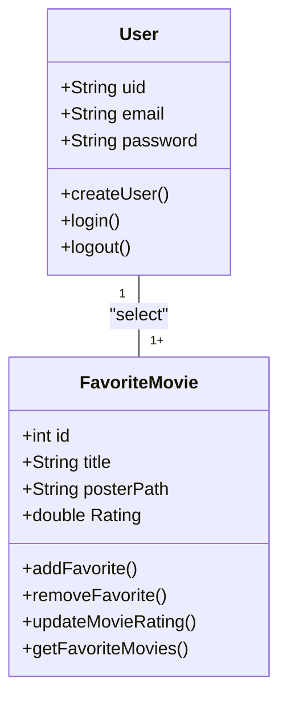

# Cine Favorite (Formativa)
Contruir um Aplicativo do Zero - O CineFavorite que permitirá criar uma conta e buscar filmes em uma API e montar uma galeria pessoal de filmes favoritos, com poster e nota avaliativa do usuário par o filme.

## Objetivos
- Criar uma Galeria Personalizada por Usuário de Filmes Favoritos
- Conectar o APP com uma API(base de dados) de Filmes (TMDB)
- Permitir a Criação de Contas para Cada Usuário
- Listar Filmes por Uma Palavra-Chave

## Levantamento de Requistos do Projeto
- ### Funcionais

- ### Não Funcionais

## Recursos do Projeto
- Linguagem de Programação : Flutter/Dart
- API TMDB: Base de Dados para Filmes
- Firebase: Authentication / FireStore
- Figma: Prototipagem 
- VSCode
- GitHub

## Diagramas
1. Classe
Demosntrar o Funcionamento das Entidades do Sistema

- Usuário (User): classe já modelada pelo FirebaseAuth
    - Atributos: email, senha, uid
    - Métodos: login, registrar, logout

-Filmes Favoritos (FavoriteMovie): Classe Modelada pelo DEV
    - Atributos: id, título, PosterPath, Nota
    - Métodos: adicionar, remover, listar, atualizaNota (CRUD)

